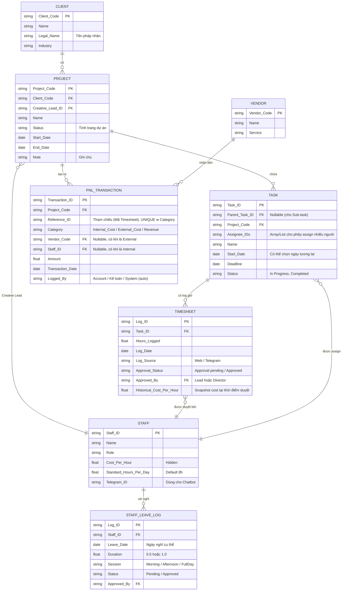

# Product Requirements Document (PRD) - FanE Traffic Management System

## 1. Overview & Objectives

**Vấn đề hiện tại (Pain points):**
- **CEO, Creative Director, Creative Project Lead, Account** thiếu bức tranh tổng thể (Big Picture) về workload, dẫn đến bị động khi có dự án mới, gây ùn tắc task.
- Không nắm được workload ngày/tuần/tháng của nhân sự, rủi ro khi nhân sự nghỉ phép, không rõ ảnh hưởng tới luồng công việc ra sao.
- Các tool hiện tại (Bitrix, Monday) thao tác nhập liệu thủ công quá nhiều, thiếu tính năng hiển thị trực quan, dẫn đến user adoption kém (không đồng lòng sử dụng).

**Mục tiêu hệ thống (Goal):**
- **Mục tiêu ngắn hạn:** Xây dựng hệ thống tập trung giải quyết bài toán quản lý workload (Traffic Management) của từng headcount trong team Creative. Giúp dễ dàng sắp xếp, phân bổ và minh bạch thông tin để đưa ra quyết định giao việc nhanh chóng.
- **Mục tiêu dài hạn:** Quản lý toàn bộ nhân sự trên mọi phòng ban. Tạo ra một luồng dữ liệu (data flow) chảy mượt mà, không có điểm nghẽn giữa các phòng ban. Từ đó, đối chiếu song song với P&L để thấy rõ hiệu quả kinh doanh của từng dự án.
*(Lưu ý: Tính năng "Export CSV" được đưa vào Backlog của Phase sau. Trong Phase hiện tại, hệ thống tập trung hoàn thiện 100% Interactive Dashboard để trực quan hóa dữ liệu).*

---

## 2. User Roles & Flows
Hệ thống phân quyền theo Data Access và thao tác. Dưới đây là hành trình của các nhóm users:

- **Ban lãnh đạo / CEO:** 
  - Có quyền xem toàn bộ Interactive Dashboard (Traffic + P&L). 
  - Quyền cấp phép (grant access) các trường dữ liệu nhạy cảm.

- **Quản lý / PO (Nhi):** 
  - Tính năng đặc biệt: **Impersonate (Đóng vai)** từng user/nhân sự để xem họ đang tương tác với hệ thống như thế nào. 
  - *Lưu ý bảo mật:* Chế độ Impersonate là **Read-Only (Chỉ xem)**. Bắt buộc xử lý ở tầng Backend Middleware (ví dụ cấp một JWT Impersonate Token chứa claim `isReadOnly = true`), chặn mọi thao tác can thiệp vào Database (POST, PUT, DELETE). Dữ liệu nhạy cảm (P&L, Cost nhân sự) chỉ BOD có access sẽ tự động bị censor (che mờ).
  - Xem Dashboard tiến độ dự án, Traffic nhân sự để nhìn ra các điểm nghẽn (bottlenecks).

- **Account:** 
  - Tạo mới `Client` và `Project`. 
  - **Bắt buộc** assign đại diện chịu trách nhiệm project từ phía creative là **"Creative Project Lead"** (tuyệt đối không được để trống trường này). Creative Project Lead được chọn từ danh sách nhân sự sẵn có trong DB. Không được để Project rơi vào trạng thái vô chủ.
  - Nhập liệu `P&L` (Estimated Budget, Dòng tiền thực tế) và Quản lý thông tin `Supplier/Vendor` (Thực hiện song song với Kế toán).
  - Xem được bảng Capacity của team Creative để biết ai đang rảnh/bận trước khi đưa brief.

- **Creative Director:**
  - Chịu trách nhiệm ở tầng cao nhất: Approve (phê duyệt) số giờ được log cho từng task của toàn team Creative.
  - Có thể trực tiếp assign một "Creative Project Lead" cho các dự án.
  - Có toàn quyền **Edit** (sửa giờ, thêm/bớt nhân sự assign) và **Delete** mọi task. *(Lưu ý: Hệ thống áp dụng cơ chế Soft Delete - tác vụ xóa thực chất là ẩn khỏi giao diện - để bảo vệ tuyệt đối dữ liệu Tài chính P&L).* Không có tính năng Merge task để tránh nhập nhằng dữ liệu.

- **Creative Project Lead:**
  - Chịu trách nhiệm điều phối dự án được giao từ phía team Creative.
  - Có quyền **Approve (phê duyệt)** số giờ được từng nhân sự log vào hệ thống cho project mà mình phụ trách. *(Ngoại trừ: Giờ log của chính Creative Project Lead thì bắt buộc phải do Creative Director duyệt để tránh self-approval fraud).*
  - Có quyền **Edit** (sửa giờ, thêm/bớt nhân sự assign) và **Delete** các task trong dự án quản lý. *(Lưu ý: Áp dụng cơ chế Soft Delete tương tự CD).*

- **Creative Team (Nhân sự thực thi):** 
  - Nhân viên có thể tự tạo `Task / Sub-task bên dưới Project` với quyền assign cụ thể như sau:
    1. Chính bản thân họ (Self-assign).
    2. Những nhân sự có cấp bậc (level) ngang bằng hoặc thấp hơn họ.
    3. Nếu nhân sự thuộc team = "Account" thì được assign task cho tất cả mọi người.
  - **Bắt buộc điền 4 trường:** `Task name`, `Description`, `Start_Date` (được chọn ngày trong tương lai), và `Deadline`.
  - **Quan hệ Parent Task & Sub-task:** Parent task & sub-task chỉ thể hiện relationship (sự liên quan) giữa 2 task. Parent task vẫn phải được đối xử (treat) như 1 task bình thường, độc lập, không phụ thuộc bất kỳ biến số nào vào sub-task (tức là KHÔNG tự động cộng dồn số giờ hay đồng bộ trạng thái). *Ví dụ: Parent task là làm proposal, sub-task là design 1 hình demo.*
  - Chủ động **Log ngày nghỉ phép** (Leave Request) lên hệ thống (0.5 ngày, 1 ngày, v.v.) để Line Manager duyệt, làm cơ sở tính toán Capacity chính xác.

- **Kế toán:**
  - Nhập liệu `P&L` và thông tin `Supplier/Vendor` (song song với Account).
  - Chỉ được xem bảng `PNL_TRANSACTION` để xem chi phí P&L. **Lưu ý bảo mật cực kỳ quan trọng:** Kế toán KHÔNG được quyền xem `Timesheet` (số giờ log) của nhân sự. Đối với các giao dịch `Internal_Cost` trong bảng `PNL_TRANSACTION`, hệ thống bắt buộc phải **ẩn (censor) cột `Staff_ID`, `Reference_ID` và `Cost_Per_Hour`** đối với role Kế toán thông qua cơ chế **Data Masking ở tầng Backend** (trả về giá trị 0 hoặc Hidden), để Kế toán không thể dùng F12 (Network tab) đọc trộm hoặc dùng phép tính chia (`Amount / Hours`) để suy ngược ra lương/thù lao của nhân sự.

---

## 3. Data Model (ERD Entity-Relationship Diagram Schema)
*(Lưu ý: Đây là schema đề xuất với các trường dữ liệu đại diện để làm rõ luồng vận hành mong muốn, chưa bao gồm tất cả các trường dữ liệu chi tiết cần thiết trong thực tế)*

## 4. Business Logic

### a. Quy trình duyệt Timesheet (Approval Flow) & Data Integrity:
- Khi task được tạo và giao cho các nhân sự chịu trách nhiệm (1 task có thể assign cho nhiều người), task có Status tổng = `In Progress`. 
- Quy trình Log Time đa kênh của nhân sự:
    - **Trên Web App:** Vào hệ thống để log số tiếng thực tế cho từng task, trong từng ngày. Nếu nhân sự đã hoàn thành xong phần việc của mình trong task đó, họ có quyền log trạng thái **"Done"**. Việc nhân sự A bấm Done chỉ có nghĩa là A đã hoàn thành việc của mình, không liên quan đến các nhân sự khác cũng được assign cho task này. Được phép log bổ sung những ngày quá khứ chưa log.
    - **Qua Telegram Chatbot:** Mỗi cuối ngày (vd: 18:00), Bot sẽ tự động bắn tin nhắn reminder nhắc nhở log giờ, kèm theo menu đầy đủ các task đang "In Progress" của nhân sự đó. 
       - **Quy tắc bỏ qua (Do Not Disturb):** Bot phải check dữ liệu và KHÔNG nhắc nhở đối với các trường hợp: (1) Ngày cuối tuần T7/CN, (2) Ngày nghỉ Lễ (Kiểm tra trong bảng `CompanyHoliday`), (3) Nhân sự có Leave Request (nghỉ phép) đã được Approved bao trùm ngày hôm đó (Kiểm tra today trùng với `leaveDate` và `session = FullDay` trong `StaffLeaveLog`), (4) Nhân sự không có bất kỳ task `In Progress` nào, hoặc đã đánh dấu **"Done"** cho toàn bộ task hiện có. *(Lưu ý hệ thống: DB cần ghi nhận cờ 'Done' ở cấp độ cá nhân Assignee để Bot ngừng nhắc)*.
       - **Inline Keyboard / Web App Link:** Tương ứng với mỗi task trong menu, Bot sẽ hiển thị song song 2 nút bấm (Inline Keyboard) để nhân sự thao tác log giờ và log status. Đồng thời, tin nhắn reminder phải luôn đính kèm **link mở thẳng Web App** để nhân sự có thể chuyển sang web để log nếu muốn.
- Sau khi nhân sự log giờ, Timesheet chuyển Status = `Approval pending`. 
- Creative Project Lead và/hoặc Creative Director vào check và duyệt số giờ (`Status = Approved`). **Task chỉ thực sự đổi trạng thái tổng thành `Completed` (và chốt End_Date) khi Lead đánh giá và approve tổng thể toàn bộ công việc của mọi nhân sự được assign**.
- **Quyền Edit trực tiếp:** Nếu số giờ log sai, Lead tự edit trực tiếp (VD: sửa từ 8h thành 5h) rồi Approve. Hệ thống tự động bắn Noti cho nhân sự: *"Giờ của bạn ở Task X đã được điều chỉnh thành 5h bởi [Tên Lead]"* trên cả webapp và Telegram bot.
- **Cảnh báo chống gian lận (Time Fraud):** Hệ thống không tự động chặn/xóa số giờ log. Tuy nhiên, trong giao diện duyệt Timesheet của Creative Project Lead hoặc CD, nếu tổng số giờ log của 1 nhân sự **vượt quá 24h trong 1 ngày**, hệ thống sẽ **bôi đỏ (Warning) nổi bật** để Quản lý kiểm tra chéo trước khi bấm Approve.
- **Khước từ "Done":** Nếu nhân viên báo xong phần việc của mình nhưng Lead đánh giá chưa đạt, Lead gỡ status "Done" của nhân viên đó. Bot sẽ tiếp tục nhắc nhân viên log giờ lại như mọi task với status `In Progress` bình thường.
- **Quy tắc "Quên Log", "Log 0" và "Log Tương lai":** Hệ thống cho phép log bổ sung lùi ngày. Ngày nào nhân viên quên log sẽ được lưu trong DB là `NULL` (không ép về `0`, không có cảnh báo đỏ) để bảo vệ tính toàn vẹn của báo cáo P&L (sếp nhìn dashboard sẽ thấy ô trống, hiểu là chưa có data). Chỉ khi nhân sự chủ động log `0` thì hệ thống mới ghi nhận giá trị 0. **Tuyệt đối không cho phép log giờ cho ngày tương lai (Log_Date <= Today).**
- Chỉ khi đạt trạng thái Approved, số giờ mới được tính vào báo cáo Capacity và tính Cost cho P&L.

### b. Chỉ số phân bổ nguồn lực (Resource Allocation Metrics):
- **Workload Capacity % (Tính theo ngày):** Phần trăm tổng số giờ Approved trên tổng thời gian làm việc tiêu chuẩn. Nếu nhân sự chưa log giờ, Capacity = 0% (Tuyệt đối không sử dụng giả định/mặc định số giờ cho task).
  - **Công thức:** `Capacity % = Tổng số giờ Approved / [(Số ngày làm việc trong kỳ - Số ngày Leave nghỉ phép) * Standard_Hours_Per_Day]` *(Linh hoạt cho cả Full-time 8h và Part-time).*
  - *Ví dụ:* Trong tuần (5 ngày làm việc = 40h), nhân viên A xin nghỉ phép 1 ngày. Thời gian làm việc chuẩn của A tuần đó là `(5 - 1) * 8 = 32h`. Nếu A log 36h, Capacity % của A = `36 / 32 = 112%` (Overload). Việc này giúp chỉ số phản ánh chính xác hiệu suất thực tế.
- **Project Allocation %:** % thời gian của một dự án trên tổng số giờ của nhân sự đó trong kỳ đánh giá. *(Ví dụ: Tổng số giờ Approved của A là 100h, trong đó Project X chiếm 40h -> Project Allocation % của X là 40%).*

### c. Traffic Dashboard Output Requirements (Screen 1):
**Approach:** Traffic Management System này ưu tiên linh hoạt và giảm thiểu nhập liệu, bỏ qua trường Estimated Hours, nên Traffic Dashboard sẽ vận hành theo dạng "Reactive Monitor". Thay vì dự báo số giờ, hệ thống theo dõi "Total Active Tasks" và Velocity quá khứ để Account tự đối chiếu năng lực thực thi khi giao brief mới).*

Để Traffic Dashboard thực sự mang tính "Real-time" và "Actionable" (hỗ trợ ra quyết định phân bổ ngay lập tức), cần hiển thị các chỉ số & UI component với các tính năng và yêu cầu như sau:

##### Zone 1: Reactive Review (Bộ lọc tổng)
- **Global Date Range Filter:** Cho phép người dùng tùy biến phạm vi thời gian hiển thị cho Zone 2 và Zone 3 (từ ngày A đến ngày B). Thiết kế UI dưới dạng nút bấm xổ ra Date Range Picker (Calendar). Không được chọn ngày trong tương lai vì Zone 2 và Zone 3 chỉ hiển thị số liệu quá đã được log, không có estimation. Không áp dụng cho Zone 4.
- **Resource/Personnel Filter:** Chức năng lọc để theo dõi thông tin của các nhân sự cụ thể. Danh sách nhân sự được thiết kế dạng nested list (phân cấp theo phòng ban và team nhỏ như trong database cấu trúc nhân sự), hỗ trợ chọn nhiều (multi-select).
##### Zone 2: Project Statistics (Số liệu dự án):
- **Total Active Tasks:** Tổng số task đang có trạng thái `In Progress`. *(Task chỉ sang Completed khi Lead đánh giá xong toàn bộ)*.
- **Total Active Projects:** Tổng số dự án đang có ít nhất 1 task `In Progress`.
- **Pending Projects (Dự án chờ Feedback):** Số lượng dự án mà toàn bộ task của team Creative đã ở trạng thái `Completed`, nhưng Project Status tổng chưa được đánh dấu là đã nghiệm thu `Closed/Accepted` mà phải chờ feedback từ account và client. 
- **Team Velocity (Tốc độ thực thi):** Bổ sung chỉ số tốc độ hoàn thành công việc của toàn team dựa trên lịch sử (VD: *Average Task Completion Rate* - Số task hoàn thành trung bình mỗi tuần, hoặc *Average Lead Time* - Số ngày trung bình để hoàn thành 1 task). Account đối chiếu Velocity với Total Active Tasks để ước lượng năng lực team.

##### Zone 3: Individual Capacity Breakdown Chart (Phân bổ năng suất cá nhân)
Sử dụng biểu đồ **Segmented Donut Chart (Donut chia mảng)** để lồng ghép các metrics vào 1 không gian hiển thị:
- **Workload Capacity % (Macro):** Con số % to, rõ ràng nằm ở tâm biểu đồ. Độ dài của dải màu donut tỷ lệ thuận với con số này (ví dụ 90% thì vòng cung chiếm 90% chu vi). *Edge Case: Nếu > 100% (Overload), donut khép kín toàn vòng 100%, không tràn ra khỏi vòng, hiển thị đúng con số, thêm effect glowing red nhẹ để cảnh báo.*
- **Current Active Tasks (Cơ chế chống ảo giác):** Do Capacity % tính trên giờ đã duyệt nên thường có độ trễ (Lagging indicator). Ngay bên dưới con số %, **bắt buộc hiển thị số lượng Active Tasks** nhân sự đang cầm (VD: *Đang gánh: 5 Tasks*). Account phải nhìn đồng thời Capacity % và Active Tasks để biết thực sự nhân sự đó đang rảnh hay đang kẹt việc chưa log.
- **Project Allocation % (Micro):** Lấy chính phần dải màu đã được occupy (ví dụ 90%) làm hệ quy chiếu 100% mới, sau đó chia cắt (slice) thành các mốc màu khác nhau tương ứng với thời lượng của từng Project. Có chú thích (Label/Tooltip) gọn gàng bên cạnh mỗi slice để xem thông tin dự án (Project name, Start date, End date).

##### Zone 4: Project Timeline
Sử dụng biểu đồ Gantt Chart thể hiện chi tiết tiến độ của từng project và nested tasks & sub-tasks tại mọi thời điểm. Không bị giới hạn bởi `Date Range Filter` ở Zone 1:
- **Ranh giới mềm (Soft Boundaries):** Hệ thống tự động bôi xám (highlight khác màu) các cột ngày cuối tuần, nghỉ lễ, và ngày mà nhân sự có `STAFF_LEAVE_LOG = Approved` (Đặc biệt có thể highlight nửa ô nếu session là Morning/Afternoon). Tuy nhiên, đây chỉ là *ranh giới mềm*. Nếu nhân sự vẫn làm và hoàn thành task trong các ngày này, dải màu Timeline của task vẫn chạy vắt ngang qua ngày bị bôi xám bình thường mà không bị ngắt quãng.
- **Nét đứt (Delay):** Khoảng cách từ `Start date` của task đến "ngày đầu tiên task được log số giờ > 0". Thể hiện trực quan độ trễ từ lúc giao task đến lúc thực sự bắt tay vào làm.
- **Dải màu đặc (Actual Activity):** Kéo dài từ "ngày đầu tiên có log > 0" đến `End date` thực tế (Là ngày nhân sự log 'Done' và được Lead approve). Ngay cả khi làm lố deadline, dải màu vẫn tiếp tục chạy theo số giờ log thực tế.
- **Cột mốc Deadline (Milestone):** Phải luôn hiển thị mốc đỏ tại ngày `Deadline` của task. Cho phép dải màu đặc vắt ngang qua để dễ dàng hình dung task đó hoàn thành sớm hay lố hạn. Trường hợp hoàn thành sớm, khoảng cách từ `End date` đến `Deadline` hiển thị nét đứt.

#### d. Project P&L (Cost & Revenue Logic - Data Warehouse structure):
Hệ thống lưu trữ mọi giao dịch tài chính (Revenue, External Cost, Internal Cost) tập trung vào một bảng duy nhất là **`PNL_TRANSACTION`**. Bảng này đóng vai trò như một Sổ cái (General Ledger) cho từng dự án, giúp cấu trúc Data Warehouse gọn gàng, không bị overlap và rất dễ scale khi phân tích OLAP.
- **External Cost (Chi phí thuê ngoài) / Revenue:** Kế toán hoặc Account nhập liệu, liên kết với `Vendor_Code`. `Category` = `External_Cost` hoặc `Revenue`.
- **Internal Cost (Chi phí nhân sự nội bộ):** Hệ thống sẽ có một Job chạy tự động (Real-time trigger hoặc Daily Batch). Mỗi khi có `Timesheet` được duyệt (`Status = Approved`), hệ thống sẽ **snapshot (lưu cứng)** mức `Cost_Per_Hour` hiện tại của nhân sự vào `Historical_Cost_Per_Hour` của Timesheet, sau đó tính toán *Amount = Hours_Logged * Historical_Cost_Per_Hour*. Cuối cùng, **tự động sinh ra một record (dòng dữ liệu) ẩn** vào bảng `PNL_TRANSACTION` với `Category = Internal_Cost`, `Staff_ID` của người thực hiện, `Logged_By = System` và `Reference_ID = Timesheet_Log_ID`. (Việc dùng Historical Cost giúp P&L quá khứ không bị nhảy số khi nhân sự được tăng lương/thay đổi cost rate sau này).
  - **[Edge Case] Xử lý cập nhật/xoá Timesheet đã duyệt:** Trong trường hợp Creative Lead tiến hành **Un-approve**, **Edit** (thay đổi số giờ), hoặc **Delete** một Timesheet đã ở trạng thái `Approved`, hệ thống bắt buộc phải có cơ chế trigger tương ứng trên bảng `PNL_TRANSACTION`: tự động Update lại `Amount` mới, hoặc Delete dòng chi phí ẩn tương ứng dựa vào `Reference_ID = Timesheet_Log_ID`. Tránh tình trạng chi phí dự án bị nhân đôi hoặc sai lệch.

Nhờ cấu trúc "quy về một mối" này, khi CEO/Account cần xem báo cáo P&L, hệ thống chỉ cần GROUP BY theo `Category` trên đúng 1 bảng `PNL_TRANSACTION` là ra được biên lợi nhuận thực tế theo thời gian thực (Real-time P&L).

Interactive P&L Dashboard là out of scope đối với PRD này, sẽ propose ở phase sau.

### e. My Portal Output Requirements (Screen 2)
**Approach:** Màn hình cá nhân hóa dành riêng cho từng nhân sự (URL: `/my-portal`), giúp theo dõi công việc và nhập liệu nhanh chóng mà không bị phân tâm bởi dữ liệu toàn công ty. Các chỉ số được "khóa" (locked) để chỉ hiển thị dữ liệu của user đang đăng nhập.

*(Lưu ý Kiến trúc: Để tối ưu hiệu năng và tránh bất đồng bộ dữ liệu, My Portal không gọi API riêng mà kế thừa Data State tổng (DashboardData) được truyền xuống từ App gốc).*

##### Zone 1: Reactive Review (Bộ lọc tổng)
- **Global Date Range Filter:** Cho phép nhân sự tùy chỉnh phạm vi thời gian hiển thị, phục vụ việc xem lại tiến độ và lịch sử chấm công quá khứ.
- Không có bộ lọc Staff (mặc định ngầm định là chính họ).

##### Zone 2: Workload
- **Active Tasks:** Số lượng task đang ở trạng thái `In Progress` được giao cho nhân sự này.
- **Active Projects:** Số lượng dự án có ít nhất 1 task đang `In Progress` của nhân sự này.

##### Zone 3: Individual Capacity (Phân tích Năng lực)
Gồm 3 thẻ (Cards) phân tích độc lập:
1. **Working Hours (Thanh tiến trình 3 lớp):**
   - Hiển thị tương quan 3 chỉ số: `(a) Standard Hours` (Giờ chuẩn trừ nghỉ phép), `(b) Hours Logged` (Giờ đã log), `(c) Hours Approved` (Giờ đã duyệt).
   - **Visual Edge Case (Overload):** Chiều dài tối đa của thanh progress bằng `MAX(Standard, Logged)`. Vạch chuẩn Standard được đánh dấu cố định bằng vạch màu trắng. Nếu Logged vượt Standard, phần vượt rào sẽ tự động chuyển màu (cảnh báo Overload).
2. **Project Allocation:** Biểu đồ Donut Chart chia mảng thời lượng theo từng dự án (tương tự Dashboard chính).
3. **Leave Balance:** Thẻ thông tin hiển thị Số ngày phép tiêu chuẩn trong năm, Số ngày đã nghỉ, và Quỹ phép còn lại. Trực tiếp lý giải cho việc giảm trừ ở thông số `(a) Standard Hours`.

##### Zone 4: Interactive Project Timeline (Tree-View Gantt Chart)
Gantt Chart chi tiết nhưng được thiết kế lại tối ưu cho thao tác nhập liệu:
- **Grouped List:** Danh sách hiển thị trục dọc được gom nhóm theo cây thư mục `Project > Parent Task > Sub-task`.
- **Nút "Create Task" Auto-fill:** Cạnh mỗi tên Project trên trục dọc có nút `[+]`. Bấm vào sẽ mở modal Tạo Task Mới (Khóa cứng trường Project = Project hiện tại).
  - *Logic Assign:* Người tạo Task chỉ được phép assign task cho:
    1. Chính bản thân họ (Self-assign).
    2. Những nhân sự có cấp bậc (level) ngang bằng hoặc thấp hơn họ (tức là giá trị `level >= currentUser.level`).
    3. Nếu role/team là "Account" thì user đó được assign task cho tất cả mọi người.
- **Interactive Time Logging (Nhập liệu trực tiếp):** Nhân sự click vào ô lưới (giao giữa Task và Cột Ngày) để nhập số giờ log. Ô đã log hiển thị số giờ nổi bật. Click vào để sửa số giờ (nếu chưa được sếp Approve). Đã Approve thì khóa cứng.
- **Mark as Done:** Checkbox sát bên trái tên Task. Bấm tick để đánh dấu Done (có thể bấm tick lại để Unmark, trả về trạng thái In Progress).

### f. Admin Portal Output Requirements (Screen 3)
**Approach:** Giao diện quản lý Dữ liệu gốc (Master Data) dành riêng cho Role Account và CEO (URL state: `currentView === 'admin'`). Thay thế hoàn toàn Prisma Studio để đảm bảo Data Integrity thông qua phân quyền chặt chẽ (RBAC) và các validate logic. Thiết kế ưu tiên nhập liệu siêu tốc với trải nghiệm Inline Editing (Add new blank row on top) tương tự Spreadsheet, không dùng Modal popup rườm rà.

##### Tương tác dữ liệu (Global Save/Revert)
- Bố trí nút màu xanh lá `[Save Changes]` và nút màu đỏ `[Revert Changes]` nổi bật nằm ngay **phía trên** của mỗi bảng dữ liệu.
- Mọi thao tác nhập liệu trực tiếp (Inline Edit), thêm dòng mới, hay xóa dòng đều được lưu tạm (Staged). Dữ liệu chỉ thực sự lưu xuống Database (hoặc rollback lại trạng thái cũ) khi Account bấm vào các nút Global này.
- **Thao tác Edit:** Click trực tiếp vào cell để edit, sau đó `Save Changes`.
- **Thao tác Xóa (Delete):** Chọn row, click chuột phải chọn `Delete`. Hệ thống **chỉ cho phép Delete** những Project/Client chưa có bất kỳ Data phát sinh nào (chưa có Timesheet, chưa có PNL). Nếu đã có data, chỉ cho phép đổi Status sang `Cancelled` hoặc `Closed`, **tuyệt đối không cho Delete**. Sau đó bấm `[Save Changes]` để thực thi xóa hoặc `[Revert Changes]` để hủy bỏ.

##### Xử lý Dữ liệu lớn (Large Dataset Handling)
Để đảm bảo trải nghiệm cuộn mượt mà (Excel-like) và tìm kiếm nhanh chóng khi dữ liệu phình to lên hàng nghìn dòng, hệ thống tích hợp các công nghệ sau cho cả Zone 1 và Zone 2:
- **Global Search & Filter:** Thanh tìm kiếm siêu tốc (real-time filtering) theo tên Client hoặc tên Project.
- **Hide Archived / Show Archived:** Toggle bar ở mỗi table cho phép hide hoặc show toàn bộ archived projects (có status Cancelled, Closed) và archived clients (là client CÓ ít nhất 1 Project VÀ 100% Project bên trong đều đã Closed/Cancelled. Client chưa có Project nào sẽ luôn luôn được hiển thị). Mặc định hide archived.
- **Virtual Scrolling (Virtualization):** Kỹ thuật chỉ render các dòng (rows) đang hiển thị trong màn hình viewport, giúp giao diện không bao giờ bị giật lag.

##### Zone 1: Client Management
- **Inline Editing Table:** Data Table liệt kê toàn bộ Khách hàng.
- **Cơ chế ẩn Client cũ (Archived Clients):** Nếu một Client **chỉ chứa toàn bộ các Project đã đóng/hủy** (Status `Cancelled`, `Closed`), Client đó mặc định sẽ bị ẩn đi. Trên bảng Client sẽ có một thanh Toggle **"Show/Hide Archived Clients"** để người dùng có thể bật hiển thị lại các Client này nếu cần.
- **Sorting:** alphabetically
- **Nút [+ New Client]:** Bấm vào sẽ chèn ngay một dòng trống (blank row) lên **trên cùng** của bảng.
- **Data Fields bắt buộc điền cho new record:** `Client Code` | `Name` | `Legal Name` (Optional) | `Industry` (Optional).

##### Zone 2: Project Management
- **Cấu trúc Nhóm (Nested Structure):** Danh sách Project được lồng ghép (nested) theo từng Client. Tên Client là Header của nhóm.
- **Cơ chế Half-Expander & Ẩn Project cũ (Archived Projects):** 
  - Chỉ tự động bung mở (expand full) danh sách dự án bên trong nếu Project có Status thuộc nhóm: `Not Started`, `In Progress`, `Pending Feedback`.
  - Các Project thuộc nhóm khác (`Cancelled`, `Closed`) mặc định được thu gọn (collapse). Ngay bên cạnh icon Dropdown (Arrow) của Client Header sẽ hiển thị tổng số lượng các Project đã thu gọn: *Expand 3 projects*).
  - Phía dưới danh sách các Project đang hoạt động của mỗi Client, bổ sung một thanh Toggle **"Show/Hide Archived Projects"** để Account có thể bật/tắt hiển thị các dự án đã đóng của riêng Client đó.
- **Sorting:** Trong mỗi nhóm Client, các Project hiển thị (expand full) được sắp xếp theo `End Date` xa nhất lên trên cùng (Furthest to the top). Các project ẩn (collapse) cũng được sắp xếp theo `End Date` xa nhất lên trên.
- **Sticky Headers:** Khi cuộn chuột, Tên Client (Header của nhóm) luôn dính chặt (sticky) ở mép trên cùng bảng để user không bị mất bối cảnh (context).
- **Flow tạo mới [+ New Project]:** 
  - Nút **[+ New Project]** được đặt ngay cạnh mỗi tên Client (Client Header). 
  - Khi bấm, một dòng Project trống sẽ tự động được tạo ra ngay bên dưới Client đó (khóa cứng liên kết với Client này.
- **Data Fields bắt buộc điền:** `Project Code` | `Project Name` | `Creative Project Lead` (Dropdown Full name của nhân sự từ DB) | `Start Date` | `End Date` (optional) | `Status` (dropdown chọn các options định sẵn: Not Started, In Progress, Pending Feedback, Closed, Cancelled) | `Note`.
- **Logic Auto-calculation:** Nếu Account bỏ trống `End Date` khi bấm Save Changes, hệ thống tự động tính toán và lưu giá trị `End Date = Start Date + 3 tháng`.

## 5. Authorization & CEO Permission Portal (Screen 4)
**Approach:** Đảm bảo Data Integrity và Security tuyệt đối từ tầng móng của hệ thống, thay thế hoàn toàn cấu trúc Role tĩnh (hardcoded). CEO có một Portal riêng để tinh chỉnh (Grant/Revoke) từng quyền cụ thể cho từng cá nhân (Granular Permissions).

### a. Kiến trúc Phân quyền (Authorization Architecture)
- **Tầng 1 (Global Guard - Granular RBAC):** Kiểm tra người dùng có được cấp quyền cơ bản để gọi API hay không (VD: `timesheet:approve_project_only`). Hệ thống đã thiết lập sẵn các **Quyền mặc định (Default Permissions) gắn với từng chức danh (Role)** dựa theo đúng Universal Rules của công ty. Nhờ đó, CEO không phải mất công cấp quyền bằng tay cho từng người mới. CEO chỉ vào Portal khi cần cấp quyền đặc biệt (Grant) hoặc tước quyền (Revoke) của một cá nhân cụ thể để ghi đè lên quyền mặc định.
- **Tầng 2 (Contextual Guard - Code Logic):** Tầng này làm nhiệm vụ "phiên dịch" các quyền có hậu tố ngữ cảnh ở Tầng 1 thành luật logic code. 
  - Nếu user có quyền đuôi `_project_only`: Code tự check xem user có phải Creative Lead của Project đó không.
  - Nếu user có quyền đuôi `_lower_level`: Code tự check cấp bậc người được assign.
  - Nếu user có quyền đuôi `_any`: Code cho qua luôn, không cần check context.
- **Tầng 3 (Data Masking & Impersonate):** 
  - **Impersonate (Act On Behalf Of):** Người được cấp quyền (VD: PO) có thể đóng vai người khác. Cho phép View, Test và Edit (để làm thay khi đồng nghiệp ốm), nhưng **tuyệt đối chặn Delete**.
  - **Data Masking:** Kế toán xem P&L sẽ tự động bị ẩn (censor) các trường nhạy cảm như `Staff_ID`, `Cost_Per_Hour`.
- **Bảng Audit Log (Bắt buộc):** Mọi thao tác ủy quyền (Grant Access) và thao tác Edit khi đang Impersonate đều bị ghi lại dấu vết (Lưu ID của người thao tác thật và ID của người bị đóng vai) để phục vụ tra soát (Audit) tự động, tránh việc thao tác lén lút.

### b. Danh mục Ma Trận Quyền (Permission Matrix)
Giao diện CEO Portal sẽ hiển thị grid tất cả nhân sự & tất cả quyền. Ma trận quyền hiển thị các chức năng với nguyên lý: **Tick xanh (Có quyền), Xám (Mặc định không có), X đỏ (Bị tước quyền mặc định)**.
Các quyền được quy định kèm (Vai trò mặc định sở hữu):
- **Client Management:** `client:create`, `client:edit`, `client:archive`, `client:delete` (Account)
- **Project Management:** `project:create`, `project:edit`, `project:archive`, `project:delete` (Account)
- **Task Assignment (Phân việc):** `task:assign_self` (Creative Team), `task:assign_lower_level` (Creative Team), `task:assign_any` (Account)
- **Task Modification (Sửa/Xóa Task):** `task:edit_project_only` (Creative Lead), `task:edit_any` (Creative Director), `task:delete_project_only` (Creative Lead), `task:delete_any` (Creative Director)
- **Timesheet & Capacity:** `timesheet:log` (Creative Team), `timesheet:approve_project_only` (Creative Lead), `timesheet:approve_any` (Creative Director), `timesheet:edit_approved`
- **Financial (P&L):** `pnl:view_full` (CEO, Account), `pnl:view_masked` (Kế toán), `pnl:manage_external` (Kế toán, Account)
- **System & Security:** `system:impersonate` (PO), `system:grant_permission` (CEO)

## 6. Infrastructure & Deployment Access (Quyền hạ tầng phần cứng)
**Approach:** Phân tách rạch ròi giữa "Quyền thao tác phần mềm" (bảo vệ bằng CEO Portal) và "Quyền can thiệp hạ tầng/Database" (Bảo vệ bằng Server). Tuyệt đối không để User bình thường có quyền can thiệp thẳng vào DB (bỏ qua Audit Log).

- **Mã nguồn (Source Code):** Quản lý qua GitHub. Việc Edit Source Code được thực hiện trên môi trường Local và push lên nhánh. Không cần CEO cấp quyền trên Web App, chỉ cần được cấp quyền Collaborator trên GitHub Repositories.
- **Database (Prisma Studio / PostgreSQL / Cloud DB):** 
  - Admin Portal (Screen 3) đã thay thế Prisma Studio cho việc thao tác Master Data của User (sửa lỗi Client, Project, Cancel). 
  - Quyền sử dụng công cụ raw như Prisma Studio bị "cất đi", chỉ cấp cho Developer, Database Admin (DBA), hoặc Tech Lead. Dùng để xử lý sự cố cấp thấp, dọn rác DB.
- **Hosting & CI/CD (Vercel / AWS):** Quyền xem log server, rollback version, deploy lên môi trường Production do Tech Lead quản lý. Bất kỳ sự thay đổi mã nguồn nào cũng phải trải qua quy trình Pull Request (PR) để review và Automated Test trước khi Deploy để bảo vệ Production.